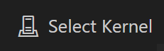
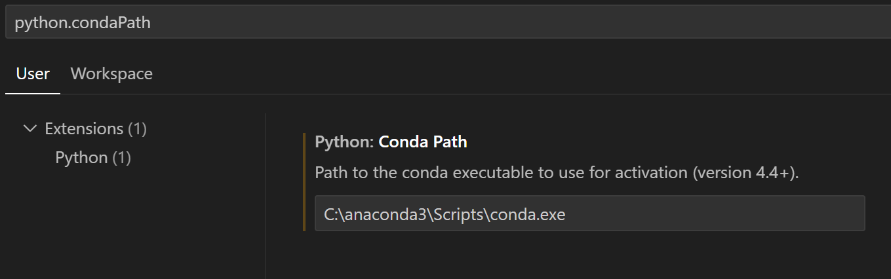

# Conda VS code Python notebook toubleshooting

Conda may not work in VS code Python notebook. Here are some common issues and solutions.

## Check if everything works

From a python notebook in VS code, click on `Select kernel` in the top right corner.



Run a cell with the following code (install `ipykernel` if requested):

```python
import carla
```

## Conda not found in VS code but works in terminal

If you have installed conda and it works in terminal but not in VS code, you may need to add the conda path to the VS code settings.

1. Search for `conda.exe` absolute path in terminal. (e.g. `C:\anaconda3\Scripts\conda.exe`).
2. Open the VS code settings by pressing `Ctrl + ,` (or `File > Preferences > Settings`).
3. Search for `python.condaPath` in the search bar.
4. Paste the conda path in the `Python: Conda Path` field.
    
5. Save the settings and restart VS code.
